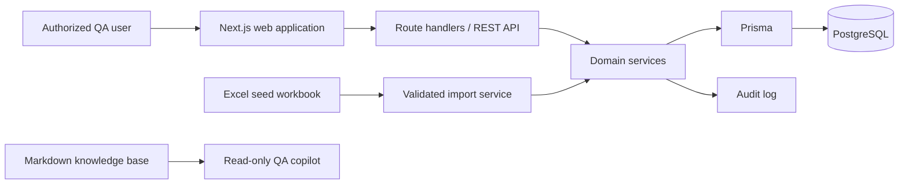

# System Architecture

## Architecture style

QAMS is a modular monolith: a Next.js TypeScript application provides the server-rendered web interface and REST/JSON API; PostgreSQL stores transactional data; Prisma owns migrations and data access. Do not split services in version 1.

## Module boundaries

| Module | Owns | Must not own |
| --- | --- | --- |
| Identity and access | Users, role assignment, authorization decisions | QA records or policy values |
| Catalogue | Product hierarchy and requirements | Test execution outcomes |
| Test design | Test cases, steps, review state | Defect workflow |
| Test execution | Executions, outcomes, immutable history | Test-case approval |
| Defect management | Native defects and resolution state | External tracker synchronization |
| Traceability and reporting | RTM projections and dashboard queries | Independent mutable copies of source data |
| Import | Workbook validation, staging, reconciliation report | Direct database writes that bypass domain services |
| Audit | Append-only change events | Authorization policy |

Domain services enforce `business-rules-and-validation.md`; route handlers only authenticate, validate request shape, call a service, and map known failures to API responses.

## Data flow

1. A user authenticates and receives a server-side session.
2. The API derives the user role server-side; clients never submit or choose their effective role.
3. The relevant domain service authorizes the requested transition, validates record and relationship invariants, persists atomically, and emits an audit event.
4. Dashboard and RTM views read current transactional data; they never write derived values back to source tables.
5. The AI copilot reads only the Markdown knowledge base. It has no database, API, or mutation tool access.

## Reliability and observability

- Use database transactions for imports and every multi-record mutation.
- Enforce unique business IDs and foreign keys in PostgreSQL in addition to service validation.
- Capture structured logs with request ID, actor ID, action, outcome, and error code; never log credentials or evidence contents.
- Maintain an append-only audit record for create, update, transition, import, and role/configuration changes.
- Back up PostgreSQL according to the deployment environment’s approved retention policy; retention duration is not defined by this knowledge base and must be escalated to the QA Lead.

## V1 exclusions

No live external issue-tracker synchronization, CI ingestion, automation-framework integration, email notification workflow, or direct AI mutations are included. New integrations require an approved policy and interface update.
