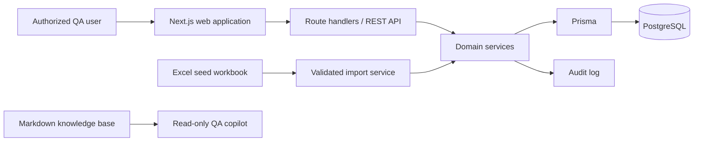

# System Architecture

## Architecture style

QAMS is a modular monolith: a Next.js TypeScript application provides the server-rendered web interface and REST/JSON API; PostgreSQL stores transactional data; Prisma owns migrations and data access. Do not split services in version 1.

## Module boundaries

| Module | Owns | Must not own |
| --- | --- | --- |
| Identity and access | Users, role assignment, authorization decisions | QA records or policy values |
| Catalogue | Product hierarchy and requirements | Test execution outcomes |
| Test design | Test cases, steps, review state | Defect workflow |
| Test execution | Executions, outcomes, immutable history | Test-case approval |
| Defect management | Native defects and resolution state | External tracker synchronization |
| Traceability and reporting | RTM projections and dashboard queries | Independent mutable copies of source data |
| Import | Workbook validation, staging, reconciliation report | Direct database writes that bypass domain services, except inside its atomic seed batches: where a domain service can run within the batch transaction the import must call it, and where a service enforces an initial lifecycle state the seed-import exception overrides (`roles-workflows.md`), the import writes directly while mirroring the documented rules |
| Audit | Append-only change events | Authorization policy |

Domain services enforce `business-rules-and-validation.md`; route handlers only authenticate, validate request shape, call a service, and map known failures to API responses.

## Web interface

The web interface is server-rendered by the same Next.js application, not a separate client app. Its rules:

- Screens and navigation derive from the role/capability matrix in `roles-workflows.md`; a screen a role cannot reach is absent from its navigation rather than present-and-rejecting. The screen inventory is the navigation module's item list (`src/ui/navigation.ts`).
- Screen mutations go through server actions that authenticate and call exactly one domain service — the same contract as route handlers. No rule is enforced only in the interface; hiding a form is presentation, and the domain service's refusal is the gate.
- Dashboard and readiness metrics render together with their stated filters, numerator, denominator, and as-of time, and are never graded against thresholds the knowledge base does not define.
- All user-entered content is rendered as plain text; no markup in stored fields is interpreted.
- Evidence references render as plain reference strings; there is no upload or preview affordance in v1.

## Data flow

1. A user authenticates and receives a server-side session.
2. The API derives the user role server-side; clients never submit or choose their effective role.
3. The relevant domain service authorizes the requested transition, validates record and relationship invariants, persists atomically, and emits an audit event.
4. Dashboard and RTM views read current transactional data; they never write derived values back to source tables.
5. The AI copilot reads only the Markdown knowledge base. It has no database, API, or mutation tool access.

## Reliability and observability

- Use database transactions for imports and every multi-record mutation.
- Enforce unique business IDs and foreign keys in PostgreSQL in addition to service validation.
- Capture structured logs with request ID, actor ID, action, outcome, and error code; never log credentials or evidence contents.
- Maintain an append-only audit record for create, update, transition, import, and role/configuration changes.
- Back up PostgreSQL according to the deployment environment’s approved retention policy; retention duration is not defined by this knowledge base and must be escalated to the QA Lead.

## V1 exclusions

No CI ingestion, automation-framework integration, email notification workflow, or direct AI mutations are included. New integrations require an approved policy and interface update.

External issue-tracker synchronization is excluded **except** for the one-way Jira syncs defined below: the execution sync, approved by the QA Lead on 2026-08-10, and the defect sync, **built but awaiting QA Lead approval** as of 2026-08-12. Jira never writes back to QAMS.

The defect sync is the first thing QAMS *creates* in another team's system rather than annotating something a person already made, which is why its approval is recorded separately from the execution sync's rather than read as covered by it. It ships switched off: a deployment that does not name a defect project key behaves exactly as it did before the feature existed.

## Jira execution sync

**Status: implemented, with two gaps.** The sync described below is live: an execution records its issue key, and the transition is attempted after a qualifying finalize. Two things are not in place. First, retrying a failed attempt is implemented but not *scheduled* — it runs only when a QA Lead, or a scheduler holding a QA Lead session, calls the retry endpoint, so a deployment that schedules nothing never retries a failed sync. Second, no screen lists terminally failed attempts, so a failure is recoverable only from `JiraSyncAttempt` rows and the audit log. Together these leave the "Exhaust the retry budget" scenario in `testing-and-acceptance.md` only partly met. The copilot may describe the sync as current behavior; it must not claim that retries happen on their own, or that a failure view exists.

A test execution may record the Jira issue key of the task it is run against. QAMS transitions that issue to a status in Jira's `done` status category only when **every** execution carrying that key is Finalized **and** every one of them derived `Pass`. No other outcome transitions the issue.

A Finalized execution whose derived result is `Fail` or `Blocked` is never transitioned. QAMS never moves an issue backwards and never reopens one: "not done" is a statement about what QAMS must not claim, not an instruction to move the issue somewhere else. Such a run may still post a result comment, which reports an outcome rather than claiming one.

An issue that QAMS has already transitioned **is transitioned again** when a run that finalized after that transition satisfies the rule above. Eligibility is a property of the issue key rather than of one run, so it stays true once met; a later run passing every case is new evidence about the issue and is reported as such. A repeat of work already reported is not, so an issue is not transitioned twice for the same set of runs. This corrects a rule that transitioned an issue at most once ever, which left an issue that a person had moved on from — worked, re-tested, and passed again — permanently unable to move ([ADR-0005](adr/0005-a-later-run-transitions-its-issue-again.md)).

A finalize that declines to transition an issue **records that decision and its reason** as a skipped attempt, audited like any other. It is not a failure and is never retried. The reason names what is holding the issue open — most often a different run sharing the key that is not finalized, or one that did not pass — and is shown on the run's own screen, so a tester can tell a deliberate decision from a broken integration without reading the source. Nothing is recorded where the integration is not configured at all: there was no decision to make and no attempt to describe.

The sync is never part of the finalize transaction. Finalization commits whether or not Jira is reachable, and the push is recorded as a separate, retryable attempt. An unreachable or failing Jira must never prevent a tester from recording test results, and no external call is made while a database transaction is open.

Because a Finalized execution is immutable, the outcome of a sync attempt is held in its own append-only record and never as mutable state on the execution.

### Result comments

**Status: implemented, and off unless a deployment enables it.** A deployment that has not set the result-comment flag behaves exactly as it did before this existed. The copilot must not describe result comments as something every Jira-connected deployment does.

Separately from the transition, QAMS may post a **result comment** on the Jira issue an execution carries: a report of what that one run found. It is posted on **every** finalize of a run carrying an issue key, whatever the run's derived result — including `Fail` and `Blocked`, which are the outcomes it exists to report. A comment reports; only a transition claims that work is finished, which is why the two answer to different rules.

The comment names the run, its purpose, its tester, its derived result and its case tallies; then each case that did **not** pass, with the defect raised for it where there is one and the reason it failed or was blocked. Passing cases are counted and never listed. Where a public address for QAMS is configured, the comment links back to the run; where none is, it carries no link rather than a guessed one. A comment is capped in length, and states how many cases it left out when it truncates.

A result comment is **never retried and has no recovery path**. The attempt is recorded and audited like a transition attempt, and the run's own screen says whether it posted, but nothing chases a failure: QAMS is the system of record for test results, so a missing comment costs a reader convenience rather than information. This is deliberately weaker than the transition, whose failure leaves a ticket wrongly open.

Comment and transition are independent. Both may follow one finalize — the comment first — and each may fail without affecting the other.

Text written by a tester (a run's purpose, a case title, a block reason, an actual result) is escaped before it reaches Jira, so it can never act as formatting, open a macro, or become a link in an issue QAMS does not own. One character is substituted rather than escaped: a backslash appears as a forward slash, because Jira's markup has no notation for a literal backslash and the escape for one is its line-break token. The comment is a report that links to the run, not a verbatim copy of it — it is also truncated, per field and per case.

## Jira defect sync

**Status: implemented, off until a product names a Jira project, and awaiting QA Lead approval of the policy above.** A product with no Jira project key behaves exactly as it did before this existed: no issue is raised, no attempt is recorded, and no query is made. That is the default for every product. The copilot must not describe the defect sync as something every Jira-connected deployment does, and must not claim the policy is approved.

Raising a defect in QAMS **raises a bug in Jira**, and QAMS stores the resulting issue key on the defect. This is the one place QAMS creates a record in another team's system rather than annotating one that already exists, which is why it is opt-in and why the project it writes to must be named explicitly ([ADR-0006](adr/0006-a-defect-raises-its-own-jira-bug.md)).

**Which Jira project a bug is raised in is an attribute of the product**, set in the Catalogue on the product itself and maintained by a QA Lead. A defect reaches its product the only way it can — through the single test case it was raised against — and lands in that product's project. Products routing to different Jira projects is the expected case, not an edge one; two products may also share a project. A product whose key is unset raises nothing, and that is what switches the feature off. It is deliberately not deployment configuration: which project a product's bugs belong in is a fact about that product, it differs between them, and it is not a secret — unlike the Jira client id, client secret and encryption key, which remain deployment-managed and unreadable at every role.

One defect is one issue. Unlike an execution's issue key, which many runs deliberately share, a defect's key is unique: a second defect can never point at an issue another defect already claimed.

The issue type created is deployment configuration, defaulting to `Bug`, because it describes how a Jira **site** names its issue types rather than anything about one product. A site where one project renamed its issue type and another did not cannot be expressed; nothing in this knowledge base establishes that case, and resolving it is a QA Lead decision.

The issue carries the defect's business ID in its summary, and its priority, severity, originating test case and reporter in its description. Priority and severity are stated as text rather than mapped onto Jira's own fields, because those field values are per-instance and an unrecognised name causes Jira to refuse the whole create — one mismatched value would mean no bug is ever raised. A deployment that wants them as real Jira fields needs a mapping policy that this knowledge base does not define; that is a QA Lead decision.

Every issue QAMS raises is labelled with the defect's business ID. The label is not decorative: creation is the only Jira write that is not idempotent, so before creating, QAMS searches for that label and **adopts an existing issue** instead of raising a second one. This is what makes a failed create safe to retry after a response was lost.

Each lifecycle transition of the defect **posts a comment** on its issue, carrying the rationale that transition required — the investigation owner, the resolution summary, the retest evidence, the closure rationale, the reopen reason. Only the rationale supplied on that transition is sent, so a comment never repeats an earlier step's. A comment reports; it never claims the work is finished.

QAMS transitions the issue to a status in Jira's `done` status category **only when the defect reaches Closed**. `Resolved` is deliberately not enough: closure is the step that requires retest evidence or a closure rationale, which is the check that decides whether the fix actually worked, and a defect may move from Resolved back to In Progress. QAMS never moves an issue backwards and never reopens one — reopening a defect does not reopen its Jira issue.

A transition attempt made when the defect is no longer Closed **records that decision and its reason** as a skipped attempt, audited like any other. It is not a failure and is never retried. This is reachable because a retry runs long after the request that queued it: a defect reopened in the meantime must not have its issue closed by a retry of the transition that closed it before.

Neither sync is part of the defect's own transaction. The defect commits whether or not Jira is reachable, and every push is recorded as a separate attempt. An unreachable or failing Jira must never prevent someone recording a defect, and no external call is made while a database transaction is open.

Creating an issue and transitioning one are **retryable** on the same bounded budget as the execution sync, after which the attempt is abandoned and needs a person. A lifecycle comment is **never retried**, on the same reasoning as a result comment: QAMS is the system of record, so a missing comment costs a reader convenience rather than information.

Text written by a person — a defect summary, a test case title, a resolution summary, a closure rationale — is escaped before it reaches Jira, under exactly the rules the result comment follows above, and is truncated per field.

The outcome of every attempt is held in its own append-only record, and the latest outcome of each kind is shown on the defect's screen: whether the bug was raised, whether the last update posted, and whether the issue moved. A defect whose issue was never raised says so there, because a defect that never reached Jira is invisible to everyone working from the board.

The issue key is shown on each row of the defects list as well as on the defect itself, and the list is searchable by it — someone holding a Jira bug can find the defect it came from. On a list row the key is always text rather than a link, because a row's one click target is the defect; the defect's own screen links it.
