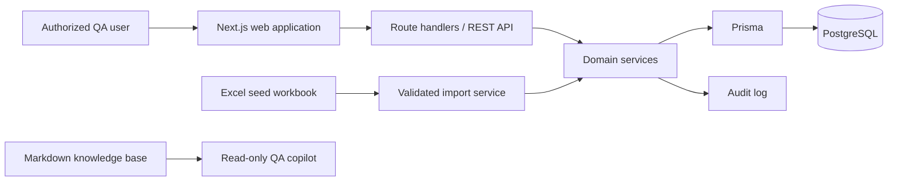

# System Architecture

## Architecture style

QAMS is a modular monolith: a Next.js TypeScript application provides the server-rendered web interface and REST/JSON API; PostgreSQL stores transactional data; Prisma owns migrations and data access. Do not split services in version 1.

## Module boundaries

| Module | Owns | Must not own |
| --- | --- | --- |
| Identity and access | Users, role assignment, authorization decisions | QA records or policy values |
| Catalogue | Product hierarchy and requirements | Test execution outcomes |
| Test design | Test cases, steps, review state | Defect workflow |
| Test execution | Executions, outcomes, immutable history | Test-case approval |
| Defect management | Native defects and resolution state | External tracker synchronization |
| Traceability and reporting | RTM projections and dashboard queries | Independent mutable copies of source data |
| Import | Workbook validation, staging, reconciliation report | Direct database writes that bypass domain services, except inside its atomic seed batches: where a domain service can run within the batch transaction the import must call it, and where a service enforces an initial lifecycle state the seed-import exception overrides (`roles-workflows.md`), the import writes directly while mirroring the documented rules |
| Audit | Append-only change events | Authorization policy |

Domain services enforce `business-rules-and-validation.md`; route handlers only authenticate, validate request shape, call a service, and map known failures to API responses.

## Web interface

The web interface is server-rendered by the same Next.js application, not a separate client app. Its rules:

- Screens and navigation derive from the role/capability matrix in `roles-workflows.md`; a screen a role cannot reach is absent from its navigation rather than present-and-rejecting. The screen inventory is the navigation module's item list (`src/ui/navigation.ts`).
- Screen mutations go through server actions that authenticate and call exactly one domain service — the same contract as route handlers. No rule is enforced only in the interface; hiding a form is presentation, and the domain service's refusal is the gate.
- Dashboard and readiness metrics render together with their stated filters, numerator, denominator, and as-of time, and are never graded against thresholds the knowledge base does not define.
- All user-entered content is rendered as plain text; no markup in stored fields is interpreted.
- Evidence references render as plain reference strings; there is no upload or preview affordance in v1.

## Data flow

1. A user authenticates and receives a server-side session.
2. The API derives the user role server-side; clients never submit or choose their effective role.
3. The relevant domain service authorizes the requested transition, validates record and relationship invariants, persists atomically, and emits an audit event.
4. Dashboard and RTM views read current transactional data; they never write derived values back to source tables.
5. The AI copilot reads only the Markdown knowledge base. It has no database, API, or mutation tool access.

## Reliability and observability

- Use database transactions for imports and every multi-record mutation.
- Enforce unique business IDs and foreign keys in PostgreSQL in addition to service validation.
- Capture structured logs with request ID, actor ID, action, outcome, and error code; never log credentials or evidence contents.
- Maintain an append-only audit record for create, update, transition, import, and role/configuration changes.
- Back up PostgreSQL according to the deployment environment’s approved retention policy; retention duration is not defined by this knowledge base and must be escalated to the QA Lead.

## V1 exclusions

No CI ingestion, automation-framework integration, email notification workflow, or direct AI mutations are included. New integrations require an approved policy and interface update.

External issue-tracker synchronization is excluded **except** for the one-way Jira execution sync defined below, approved by the QA Lead on 2026-08-10. Jira never writes back to QAMS.

## Jira execution sync

**Status: implemented, with two gaps.** The sync described below is live: an execution records its issue key, and the transition is attempted after a qualifying finalize. Two things are not in place. First, retrying a failed attempt is implemented but not *scheduled* — it runs only when a QA Lead, or a scheduler holding a QA Lead session, calls the retry endpoint, so a deployment that schedules nothing never retries a failed sync. Second, no screen lists terminally failed attempts, so a failure is recoverable only from `JiraSyncAttempt` rows and the audit log. Together these leave the "Exhaust the retry budget" scenario in `testing-and-acceptance.md` only partly met. The copilot may describe the sync as current behavior; it must not claim that retries happen on their own, or that a failure view exists.

A test execution may record the Jira issue key of the task it is run against. QAMS transitions that issue to a status in Jira's `done` status category only when **every** execution carrying that key is Finalized **and** every one of them derived `Pass`. No other outcome transitions the issue.

A Finalized execution whose derived result is `Fail` or `Blocked` causes no Jira write at all. QAMS never moves an issue backwards and never reopens one: "not done" is a statement about what QAMS must not claim, not an instruction to move the issue somewhere else.

The sync is never part of the finalize transaction. Finalization commits whether or not Jira is reachable, and the push is recorded as a separate, retryable attempt. An unreachable or failing Jira must never prevent a tester from recording test results, and no external call is made while a database transaction is open.

Because a Finalized execution is immutable, the outcome of a sync attempt is held in its own append-only record and never as mutable state on the execution.
